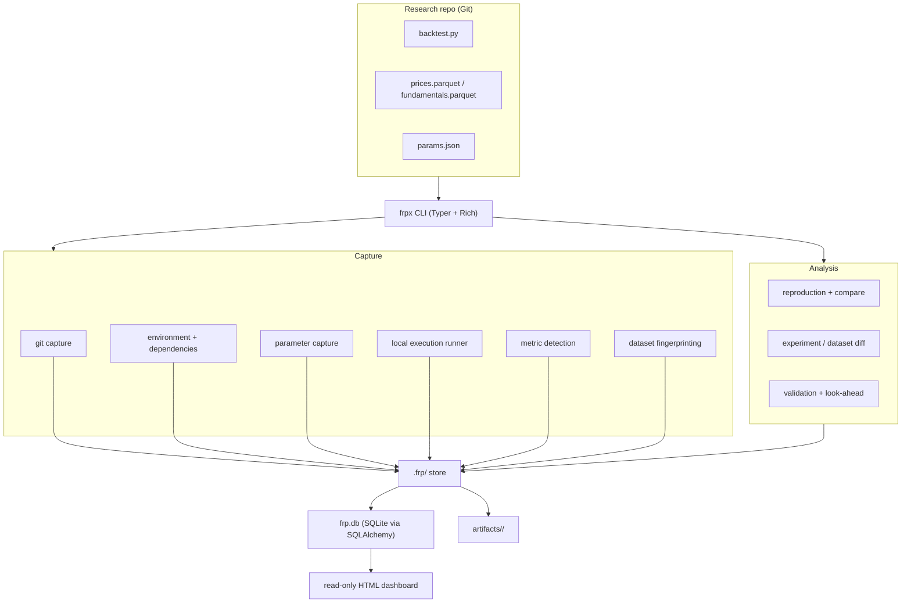

# Financial Research Provenance (FRP)

> **A provenance and reproducibility layer for quantitative research.**

FRP versions the **entire financial experiment** — code, data, data
transformations, parameters, environment, dependencies, execution metadata, and
results — so that a backtest you run today can be understood, audited, and
reproduced months later.

FRP **complements Git**. Git versions your source code; FRP versions the
complete research *state* at the moment an experiment ran. It is **not** "GitHub
for financial data" and it does not try to replace Git.

The CLI entry point is **`frpx`** (the bare name `frp` collides with an
unrelated reverse-proxy tool, so the command is `frpx`).

---

## Table of contents

1. [The problem](#the-problem)
2. [What FRP does](#what-frp-does)
3. [Install](#install)
4. [Quick start](#quick-start)
5. [Concepts](#concepts)
6. [Command reference](#command-reference)
7. [How capture works](#how-capture-works)
8. [Parameters & metrics conventions](#parameters--metrics-conventions)
9. [Point-in-time data & look-ahead warnings](#point-in-time-data--look-ahead-warnings)
10. [Data model](#data-model)
11. [Architecture](#architecture)
12. [The `.frp/` store layout](#the-frp-store-layout)
13. [Examples](#examples)
14. [Benchmarks](#benchmarks)
15. [Security model](#security-model)
16. [Distributing FRP to other people](#distributing-frp-to-other-people)
17. [Reproducing this project from source](#reproducing-this-project-from-source)
18. [Development](#development)
19. [Roadmap & honest limitations](#roadmap--honest-limitations)

---

## The problem

A quantitative researcher runs a backtest today and gets **Sharpe = 1.42**.
Six months later they rerun it and get **Sharpe = 1.08**. They need to know:

- Did the code change?
- Did the dataset change, or were historical values revised?
- Did dependencies or the environment change?
- Did parameters or the data-processing pipeline change?
- Was there accidental look-ahead bias?
- Can the original result actually be reproduced?

Financial research often cannot be reliably reproduced because the full research
*state* is not preserved. FRP makes these questions answerable.

## What FRP does

For every run, FRP captures:

**code + data + environment + parameters + execution + results**

Each run becomes an **immutable experiment** with two content hashes:

- `input_hash` — covers only the reproducible inputs (code commit, input dataset
  hashes, parameters, environment hash).
- `content_hash` — covers the full result state (inputs + outputs + metrics).

Re-running produces a **new** experiment id; existing records are never mutated.
This lets FRP answer "same inputs, different result?" precisely.

---

## Install

FRP is a local-first Python tool (Python **3.10+**). It uses SQLite (bundled
with Python) — **no database server or cloud infrastructure required**.

### Option A — from source (recommended during development)

```bash
git clone <your-repo-url> frp
cd frp
python -m venv .venv
# Windows:  .venv\Scripts\activate
# macOS/Linux:  source .venv/bin/activate
pip install -e ".[dev]"
```

This installs the `frpx` command on your PATH inside the virtual environment.

### Option B — from a built wheel (for end users)

```bash
python -m pip install build
python -m build --wheel           # produces dist/frp-0.1.0-py3-none-any.whl
pip install dist/frp-0.1.0-py3-none-any.whl
```

### Verify the install

```bash
frpx --help
# or, without installing the entry point:
python -m frp.cli.app --help
```

Runtime dependencies (installed automatically): `typer`, `rich`, `sqlalchemy`,
`polars`, `pyarrow`.

---

## Quick start

```bash
# In your research repo (ideally a git repository)
cd my-research
frpx init                        # creates .frp/ (SQLite store + config)
frpx run python backtest.py      # runs your script, records an experiment
frpx list                        # see all experiments
frpx show exp_a1b2c3d4e5f6        # inspect one in detail
```

Example run output:

```
FRP Experiment

✓ Git commit captured
✓ Python environment captured
✓ Parameters captured (2)
✓ Execution completed
✓ Metrics detected (3)

┌ FRP Experiment ─────────────────────────┐
│ Experiment: exp_a1b2c3d4e5f6             │
│ Git commit: 8f31a2c9                     │
│ Duration: 412 ms                         │
│                                          │
│ cagr: 18.3%                              │
│ max_drawdown: -12.1%                     │
│ sharpe: 1.42                             │
│                                          │
│ Run frpx show exp_a1b2c3d4e5f6 to        │
│ inspect the experiment.                  │
└──────────────────────────────────────────┘
```

Later, verify reproducibility and compare runs:

```bash
frpx reproduce exp_a1b2c3d4e5f6
frpx diff exp_a1b2c3d4e5f6 exp_9f8e7d6c5b4a
```

---

## Concepts

- **Project** — a research repo initialized with `frpx init`. State lives in
  `.frp/` at the project root.
- **Experiment** — one immutable run of a command, with all captured state and a
  `content_hash`/`input_hash`.
- **Dataset & DatasetSnapshot** — a logical input dataset (by path) and one or
  more **content-addressed, immutable** snapshots (deduplicated by SHA-256).
- **Data identity vs. data storage** — FRP always computes a content hash +
  metadata for a dataset (*identity*). Copying raw bytes into a store is a
  separate, opt-in concern (*storage*). The MVP fingerprints in place and does
  not copy large datasets.
- **Lineage** — edges recording `dataset → experiment → artifact` relationships.
- **Reproduction** — re-running an experiment's command and comparing results,
  honestly reporting which known inputs differ.

---

## Command reference

All commands are subcommands of `frpx` (equivalently `python -m frp.cli.app`).
Most support `--json` for machine-readable output.

| Command | Description |
| --- | --- |
| `frpx init [--name NAME]` | Initialize an FRP project (`.frp/`) in the current directory. |
| `frpx status` | Show project, git state, and last experiment. |
| `frpx run [-p k=v] [-i PATH] [--timeout N] <cmd...>` | Run a command and record an immutable experiment. |
| `frpx list [--json]` | List experiments (newest first). |
| `frpx show <exp_id> [--json]` | Show full experiment details. |
| `frpx reproduce <exp_id> [--timeout N] [--json]` | Re-run and compare against the original. |
| `frpx diff <exp_a> <exp_b> [--json]` | Diff two experiments (code/data/params/env/results). |
| `frpx validate <path> [--json]` | Run data-quality checks on a dataset file. |
| `frpx dashboard [--export FILE] [--json] [--host H] [--port P]` | Serve or export a read-only web dashboard. |
| `frpx dataset add <path> [--name NAME]` | Fingerprint + register a dataset. |
| `frpx dataset list` | List registered datasets and their latest snapshot. |
| `frpx dataset diff <a> <b> [--json]` | Diff two dataset files (rows/schema/columns/dtypes/date-range). |

### Command examples

```bash
# Declare input datasets so they are fingerprinted and linked to the experiment
frpx run --input prices.parquet --input fundamentals.parquet python backtest.py

# Override a parameter for this run (recorded in the experiment)
frpx run --param lookback=120 python backtest.py

# Kill a runaway script after 60 seconds
frpx run --timeout 60 python backtest.py

# Compare two runs to answer "what changed?"
frpx diff exp_1111aaaa2222 exp_3333bbbb4444

# Validate a dataset (exits non-zero if any error-severity check fails)
frpx validate prices.parquet

# Export a shareable, self-contained HTML dashboard
frpx dashboard --export dashboard.html
```

---

## How capture works

When you run `frpx run <cmd...>`, FRP:

1. **Captures the Git commit** (sha, branch, dirty flag, diff hash) if the
   project is a git repo.
2. **Captures the environment**: Python version, platform, and installed
   dependencies (hashed into an `environment.hash`).
3. **Captures parameters** from `params.json` plus any `--param` overrides.
4. **Fingerprints declared input datasets** (`--input`): SHA-256 + schema, row
   count, column dtypes, and a detected date range.
5. **Checks for look-ahead bias** if a `backtest_date` parameter is present.
6. **Runs your command** as a normal local subprocess and captures exit code,
   stdout/stderr, timing, and newly-created files (candidate outputs).
7. **Detects metrics** from `metrics.json` and/or `FRP_METRIC` stdout lines.
8. **Persists an immutable experiment** (copies output artifacts into the store,
   computes `input_hash` and `content_hash`, records lineage edges).

---

## Parameters & metrics conventions

**Parameters** are read from `params.json` in the project root:

```json
{ "lookback": 90, "rebalance": "monthly" }
```

Override per-run with `--param key=value` (repeatable). FRP records the declared
parameters; whether your script consumes them is up to your script.

**Metrics** are detected two ways (deterministic — no AI extraction):

1. A `metrics.json` file written by your script (preferred):
   ```json
   { "sharpe": 1.42, "cagr": 0.183, "max_drawdown": -0.121 }
   ```
2. Lines printed to stdout in the form:
   ```
   FRP_METRIC sharpe=1.42
   FRP_METRIC cagr=0.183
   ```

---

## Point-in-time data & look-ahead warnings

FRP lays a foundation for point-in-time correctness without pretending to solve
it universally. A dataset may declare metadata via a sidecar file
`<dataset>.frpmeta.json`:

```json
{ "source": "vendor-x", "publication_date": "2023-05-04", "effective_date": "2023-03-31" }
```

If your run declares a decision date via a `backtest_date` (or `decision_date` /
`as_of`) parameter, and a declared input dataset's `publication_date` is **after**
that date, FRP prints:

```
⚠ Potential look-ahead bias detected
  ⚠ fundamentals.parquet: publication 2023-05-04 > backtest 2023-03-31
    POTENTIAL LOOK-AHEAD BIAS — this information may not have been available
    at the time of the simulated decision.
```

**This is a warning system, not a mathematical proof.** It only reasons about
metadata you provide and cannot detect all forms of look-ahead bias.

---

## Data model

The store is SQLite via SQLAlchemy. Core entities:

- **Project** — name, root path (unique).
- **Experiment** — id (`exp_<12 hex>`), status, command, timing, exit code,
  `content_hash`, `input_hash`, `parent_experiment_id` (set for reproductions),
  FKs to git commit and environment.
- **GitCommit** — commit sha, branch, dirty, diff hash, remote url.
- **Environment** — python version, platform, os, hostname, dependency-set hash.
- **Dependency** — name, version, source (belongs to an Environment).
- **Parameter** — key, value, type, source (belongs to an Experiment).
- **Metric** — key, value, unit, source (belongs to an Experiment).
- **Artifact** — relative path, sha256, size, mime (output files copied into the
  store).
- **Dataset** — logical dataset (project + canonical path).
- **DatasetSnapshot** — content-addressed immutable snapshot: sha256, size, row
  count, schema/columns/dtypes, date range, and point-in-time fields
  (source/publication/effective/revision).
- **ExperimentDataset** — links an experiment to a dataset snapshot with a role
  (`input`).
- **LineageEdge** — `from_node → to_node` with an edge type (`consumes`,
  `produces`).

Design principles: immutability, content hashing, explicit unique constraints on
identity fields, and indexes on foreign keys and hashes.

---

## Architecture



Package layout:

```
frp/
  cli/            # Typer app + Rich rendering (frpx entry point)
  store/          # paths, config, SQLite engine/session
  models/         # SQLAlchemy entities
  capture/        # git, environment, parameters
  execution/      # subprocess runner, metric detection
  experiments/    # experiment service + id generation
  datasets/       # fingerprinting + content-addressed registry
  reproduction/   # re-run orchestrator + comparison
  diff/           # experiment diff + dataset diff
  validation/     # data-quality checks + look-ahead
  dashboard/      # read-only data export + static HTML server
examples/
  momentum-strategy/   # synthetic demo
  factor-model/        # synthetic demo
benchmarks/            # measured micro-benchmarks (synthetic data)
tests/                 # pytest suite (72 tests)
docs/                  # ARCHITECTURE.md, SECURITY.md
```

---

## The `.frp/` store layout

`frpx init` creates, at your project root:

```
.frp/
  config.json        # project name + settings (e.g. metric_tolerance)
  frp.db             # SQLite database (all experiment metadata)
  artifacts/
    <exp_id>/        # copies of output artifacts for that experiment
```

`.frp/` is per-project and is git-ignored by default (see `.gitignore`).

---

## Examples

Two fully synthetic, deterministic demos live under `examples/`. **All data is
synthetic; nothing is real market data or investment advice.**

### Momentum strategy

```bash
cd examples/momentum-strategy
frpx init
frpx run python backtest.py
```

### Factor model

```bash
cd examples/factor-model
frpx init
frpx run python backtest.py
frpx reproduce <exp_id>     # deterministic → ✓ REPRODUCED
```

Change a parameter in `params.json`, run again, then `frpx diff <old> <new>` to
see exactly what changed and how the metrics moved.

---

## Benchmarks

Real, measured micro-benchmarks (synthetic data only):

```bash
python benchmarks/bench.py
```

See [`benchmarks/README.md`](benchmarks/README.md) for methodology and
order-of-magnitude results. Numbers vary by machine and are not published
guarantees.

---

## Security model

**FRP executes your research code locally, in your own shell context. It is NOT
sandboxed.** Only run code you trust.

- FRP never fetches or executes remote code.
- Experiment ids are validated before any DB lookup.
- FRP refuses to record artifacts outside the project root (path-traversal
  protection).
- Malformed dataset metadata sidecars fail cleanly rather than being trusted.

If server-side execution is added later, it must isolate jobs (restricted
network/filesystem, CPU/memory limits, non-root, timeouts). See
[`docs/SECURITY.md`](docs/SECURITY.md).

---

## Distributing FRP to other people

FRP is a standard Python package; anyone with Python 3.10+ can use it.

### 1. Build a wheel and share it

```bash
python -m pip install build
python -m build            # writes dist/frp-0.1.0-py3-none-any.whl (+ sdist)
```

Send the `.whl` (or `.tar.gz`) file. The recipient installs it into their own
environment:

```bash
python -m venv .venv && source .venv/bin/activate    # (Windows: .venv\Scripts\activate)
pip install frp-0.1.0-py3-none-any.whl
frpx --help
```

### 2. Share the repository

Anyone can clone and install editable:

```bash
git clone <your-repo-url> frp
cd frp
pip install -e ".[dev]"
```

### 3. Publish to a package index (optional)

The package is PyPI-ready (`pyproject.toml` with a `frpx` console script). To
publish:

```bash
python -m build
python -m pip install twine
python -m twine upload dist/*      # requires PyPI credentials
```

Then others install with `pip install frp` and get the `frpx` command.

### 4. Reproducible environments for collaborators

Because FRP records the dependency set per experiment, collaborators can align
their environment before reproducing. For byte-for-byte environments, distribute
a lockfile (e.g. `pip freeze > requirements.txt`, or a `uv`/`poetry` lock) and
have collaborators install from it before `frpx reproduce`.

> Note: `frpx reproduce` re-runs in the **current** environment and reports any
> input differences it detects; it does not itself rebuild a past environment.

---

## Reproducing this project from source

To reproduce the full project and its verification on a fresh machine:

```bash
# 1. Clone and enter
git clone <your-repo-url> frp
cd frp

# 2. Create an isolated environment (Python 3.10+)
python -m venv .venv
source .venv/bin/activate        # Windows: .venv\Scripts\activate

# 3. Install with dev tooling
pip install -e ".[dev]"

# 4. Run the full verification suite
pytest                            # 72 tests
ruff check frp tests benchmarks   # lint
mypy frp                          # type check

# 5. Run the benchmarks (measured locally)
python benchmarks/bench.py

# 6. Try the end-to-end demo
cd examples/factor-model
frpx init
frpx run python backtest.py
frpx reproduce <exp_id>           # should print ✓ REPRODUCED
```

Everything is local and deterministic; no network or cloud services are needed.

---

## Development

```bash
pip install -e ".[dev]"
pytest                             # run tests
ruff check frp tests benchmarks    # lint
mypy frp                           # type check
```

- Tests live in `tests/` (pytest). Fixtures for a temp project/session are in
  `tests/conftest.py`.
- Style: `ruff` (line length 100); types: `mypy`.
- All example/benchmark data is synthetic and clearly labeled.

---

## Roadmap & honest limitations

Implemented in this MVP:

- **Phase 1 — Local capture**: `init`, `status`, `run`, `list`, `show`;
  immutable experiments with `content_hash` + `input_hash`.
- **Phase 2 — Dataset provenance**: fingerprinting, content-addressed immutable
  snapshots, lineage, `dataset add/list`, `run --input`.
- **Phase 3 — Reproduction**: `reproduce` re-runs, compares metrics within a
  configurable tolerance, and reports which inputs differ.
- **Phase 4 — Diff**: `diff` (experiments) and `dataset diff` (files).
- **Phase 5 — Validation & point-in-time**: `validate` data-quality checks and
  look-ahead warnings.
- **Phase 6 — Dashboard**: read-only, self-contained HTML (serve or export).
- **Phase 7 — Polish**: benchmarks, second example, security tests, packaging.

Honest limitations (by design for the MVP):

- Local execution is **not sandboxed**.
- Reproduction runs in the current environment and reports drift; it does not
  rebuild a past interpreter/dependency state.
- Look-ahead detection depends on researcher-supplied publication dates and
  cannot catch all bias.
- Output detection is mtime-based; declared inputs (`--input`) are explicit.
- The dashboard is a stdlib-served static HTML page; the `--json` export defines
  the exact contract a richer SPA (e.g. Next.js) could consume later.

Planned next: dataset object-storage snapshots, richer point-in-time datasets,
cloud collaboration, and team research infrastructure. This README describes
only what is implemented today plus clearly-labeled plans; it does not claim
unimplemented features work.

---

All example data is **synthetic** and clearly labeled as such. FRP never
fabricates financial data or benchmark results, and never claims perfect
reproducibility it cannot guarantee.